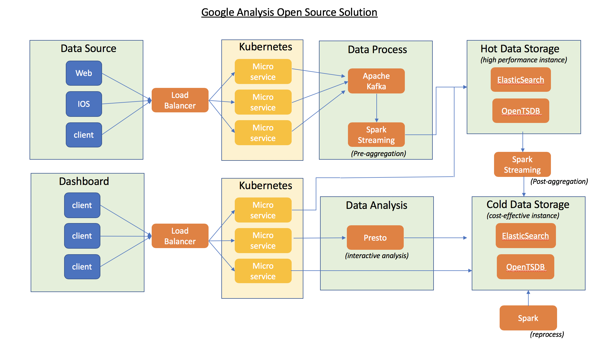

### Question
Design Question: Design A Google Analytic like Backend System. We need to provide Google Analytic like services to our customers. Pls provide a high level solution design for the backend system. Feel free to choose any open source tools as you want.

The system needs to:

- handle large write volume: Billions write events per day.

- handle large read/query volume: Millions merchants want to get insight about their business. Read/Query patterns are time-series related metrics.

- provide metrics to customers with at most one hour delay.

- run with minimum downtime.

- have the ability to reprocess historical data in case of bugs in the processing logic.

### Analysis
According to the system requirements, we need to store the <b> high volume data </b> and provide the <b> high read/ write capability </b>, also need have <b> HA </b> mechansim. 

For Google Analytics has four hierarchies, includes <b> collection, configuration, processing and reporting</b>.

### Architecture
##### Client
- Clients need to embed a tracking code to send the data to server side.
##### Service
- Service side adopts micro service architecture and can be deployed on <b> Kubernetes </b> or container based environment to provide the <b> scalability, high availability and fault-tolerance capability </b>.
- For service development, we can base on <b>Spring boot </b>framework.
- In front of the service, we can set up a load balancer to balance the network traffic.
##### Kafka + Spark Streaming
- Because the data what we collect is <b>time series data</b>, the time series data can be for time range query. For range queries for multiple time series, the results are usually aggregated. This aggregation is for values at the same time point on different time series. 
- We can have the pre-aggregation and post-aggregation to compute data. Pre-aggregation computes the data and then store it, while post-aggregation queries the stored data and then computes it. 
- For stream computing, we can set up <b> Apache Kafka and Spark Streaming </b>. Kafka ingest data then Spark Streaming can compute data. Both also have scalable ability.
#####  ElasticSearch + OpenTSDB
- Time series data is typical non-relational data. It is characterized by high concurrency, high throughput, large data volume.The query mode is usually range query. For these data characteristics, it is very suitable to use a database such as NoSQL. In here, we can choose <b>OpenTSDB</b> as our open source data storage solution. 
- For metadata search, Metadata for the time series will also be large in magnitude, so a distributed database is first considered. In addition, because the query mode needs to support retrieval, the database needs to support index, and open source <b>Elasticsearch</b> can be used.
- Furthermore, we can separate data into cold and hot data. Recently written data is accessed more frequently. Based on this feature, the hot data adopts storage medium with a higher hardware specification, which greatly improves the overall query efficiency, and cold data can use the cheaper cost-effective instances.
- In long term analysis or data reprocessing, we can have a <b>Spark</b> job to batch process the cold data, and reduce impact on our users. 
##### Presto
- In data analysis, we can provide the three ways for data access in our API.
- For interactive data analysis, usually requires a powerful distributed computing engine. <b> Presto </b> can be selected. 
- For hot or cold data access, can easily retrieve the metadata in ElasticSearch and query   time range data from OpenTSDB.
##### Dashboard
- Dashboard, is a web application, which provides the different time charts to show the monitoring data, and provides the different query tools on it.
